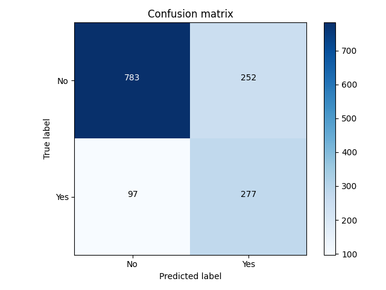

# Projeto Final: Agente de Previsão de Churn com Explicação e API

**Aluno:** Alex Gabriel Alves Faustino  
**Trilha / projeto:** Trilha 1, solução de churn para clientes de telecomunicações  
**Aplicação em produção:** https://my-churn-app.fly.dev/  
**Formato de trabalho:** individual
**Demonstração** https://youtu.be/Zmd-ExOKidw

## 1. Definição do problema

O problema tratado neste projeto é a evasão de clientes, conhecida como churn, em um cenário de telecomunicações. Em negócios de assinatura, perder clientes é caro porque a empresa já investiu em aquisição e ativação, e o cancelamento reduz receita recorrente. O objetivo do sistema é apoiar uma equipe de retenção com uma previsão de risco e uma explicação operacional em linguagem simples, para que a resposta não seja apenas uma classe binária, mas uma ação sugerida.

Os principais stakeholders são:

- time comercial ou de retenção, que usa a previsão para priorizar contatos;
- cliente final, que é afetado por ofertas, suporte ou ajustes de plano;
- time de produto/gestão, que acompanha métricas de uso, latência e falhas;
- equipe técnica, que mantém o modelo, a API e o front-end.

### Métricas de sucesso

**Negócio:** reduzir churn e priorizar clientes com maior risco aparente, com respostas acionáveis em tempo útil para contato humano.

**Técnica:** maximizar a qualidade do classificador e manter o sistema estável e responsivo. No projeto isso aparece como ROC-AUC, PR-AUC, F1 da classe positiva, taxa de rejeição de entradas inválidas, taxa de fallback do agente e latência ponta a ponta.

## 2. O que é o app

O aplicativo é uma interface web simples para análise de churn. O usuário faz login, preenche um formulário com dados do cliente e recebe:

- probabilidade de churn;
- classificação em alto ou baixo risco;
- explicação gerada por LLM em português;
- ação sugerida para retenção.

A interface foi mantida propositalmente simples para reduzir atrito de uso e concentrar o valor no fluxo principal: entrada de dados, resposta rápida e interpretação legível. O produto foi publicado em Fly.io e pode ser acessado pelo link acima.

## 3. Como o sistema é montado

### Arquitetura

```mermaid
flowchart LR
    U[Usuário] --> F[Front-end HTML/CSS/JS]
    F --> L[/login/]
    L --> K[/get_api_key/]
    F --> P[/predict/]
    P --> V[Validação de entrada]
    V --> M[Modelo RandomForest]
    M --> A[Agente LLM]
    A --> S[Sanitização e fallback]
    S --> R[Resposta ao usuário]
    P --> O[Métricas e logs]
    O --> X[/metrics/ e metrics_history.jsonl]
```

### Componentes

- O front-end fica em [backend/templates/index.html](../backend/templates/index.html) e [backend/static/script.js](../backend/static/script.js).
- A API principal fica em [backend/app.py](../backend/app.py).
- O modelo de churn fica em [backend/services/predictor.py](../backend/services/predictor.py).
- O agente gerador de explicação fica em [backend/services/ai_agent.py](../backend/services/ai_agent.py).
- A validação de entrada fica em [backend/services/validators.py](../backend/services/validators.py).
- As métricas ficam em [backend/services/metrics.py](../backend/services/metrics.py).
- A persistência de métricas em JSONL fica em [backend/services/persistence.py](../backend/services/persistence.py).

### Deployment

O sistema foi empacotado com Docker e publicado em Fly.io.

- O container é construído a partir de [Dockerfile](../Dockerfile).
- O runtime expõe a aplicação FastAPI na porta `8000`.
- O Fly é configurado em [fly.toml](../fly.toml), com `force_https`, autoscaling para zero e volume montado em `/data` para persistência de métricas.
- O fluxo de deploy manual é apoiado pelo [Makefile](../Makefile), com alvos para `docker-build`, `docker-up`, `test`, `evaluate` e comandos `fly-*`.

### Confiabilidade e fallback

O sistema é resiliente em nível básico:

- valida a entrada antes de chamar o modelo;
- não mostra stack trace cru ao usuário;
- retorna fallback textual se o LLM falhar ou devolver JSON inválido;
- registra métricas de chamadas e fallbacks;
- persiste snapshots de métricas em segundo plano.

## 4. Descrição do agente

### Modelo base e ferramentas

O agente usa a API do Gemini via `google-genai`. O modelo configurado no ambiente do projeto é `gemini-3.1-flash-lite-preview`, definido em [backend/.env.example](../backend/.env.example) e lido em [backend/services/ai_agent.py](../backend/services/ai_agent.py).

Motivo da escolha:

- custo baixo para um fluxo de explicação curto e disponivel para estudantes;
- boa latência relativa para produção simples;
- capacidade suficiente para transformar a saída do classificador em texto operacional em português.

Ferramentas do agente:

- o agente recebe o payload do cliente e o resultado da predição;
- a “ferramenta” do sistema é a própria resposta do modelo base, com prompt instruindo explicação e ação sugerida.

### Dados e contexto

O contexto do agente é estruturado e vem do próprio formulário de churn:

- atributos demográficos e contratuais;
- métricas de cobrança;
- resultado do classificador (`probabilidade` e `classificacao`).

O dataset usado no treino é o **Telco Customer Churn**, salvo em [backend/data/Telco-Customer-Churn.csv](../backend/data/Telco-Customer-Churn.csv).

Fonte declarada no projeto:

- Kaggle: Telco Customer Churn, por BlastChar;
- referência ao IBM Sample Data Sets, que originou a base de exemplo.
- Licença: "Data files © Original Authors" (Kaggle), utilizada exclusivamente para fins acadêmicos.

### Guardrails

**Entrada:**

- `tenure` não pode ser negativo;
- `MonthlyCharges` não pode ser negativo;
- `TotalCharges` não pode ser negativo;
- `gender` precisa ser `Male` ou `Female`;
- `Contract` precisa ser um dos valores esperados.

Essas regras estão em [backend/services/validators.py](../backend/services/validators.py).

**Saída:**

- o texto do agente é sanitizado para remover HTML e caracteres de controle;
- a resposta precisa validar o schema `explicacao` + `acao_sugerida`;
- se o LLM falhar, o sistema devolve uma resposta padrão curta;
- o front-end trata respostas inválidas sem expor erro técnico cru.

### Iterações de prompt e design

A solução final foi mantida simples: um classificador base gera risco e o LLM transforma isso em linguagem de negócio. O prompt em [backend/services/ai_agent.py](../backend/services/ai_agent.py) foi escrito para:

- obrigar resposta em português;
- limitar a saída a JSON;
- evitar comentários extras;
- padronizar o texto com classificação de risco consistente.

O que não foi adotado nesta versão:

- RAG;
- integração com ferramentas externas;
- múltiplas chamadas em cadeia ao LLM;
- orquestração de agentes mais complexa.
- Versionamento de modelo com MlFlow

Essas funcionalidades foram consideradas durante o planejamento, porém não foram implementadas nesta versão do projeto devido ao tempo disponível para desenvolvimento e à decisão de realizar todo o trabalho individualmente. Dessa forma, optou-se por concentrar os esforços na entrega de um MVP funcional, confiável e totalmente integrado, atendendo aos requisitos propostos pela disciplina. Essa decisão também contribuiu para manter o sistema previsível, auditável e de fácil implantação como produto final.

## 5. Treino, divisão de dados e modelo

### Forma de treino

O modelo foi treinado por um pipeline de scikit-learn em [backend/training/train.py](../backend/training/train.py):

- leitura do CSV do Telco Churn;
- remoção da coluna `customerID`;
- conversão de `TotalCharges` para numérico;
- separação entre variáveis categóricas e numéricas;
- imputação de valores ausentes;
- one-hot encoding das variáveis categóricas;
- RandomForestClassifier como classificador final.

### Modelo escolhido

O modelo base é um `RandomForestClassifier` com:

- `n_estimators=200`;
- `random_state=42`;
- `class_weight="balanced"`.

Motivos da escolha:

- funciona bem como baseline para dados tabulares;
- lida razoavelmente com relações não lineares;
- reduz necessidade de engenharia manual complexa;
- é fácil de serializar e servir com `joblib`.

### Divisão de dados

O treino usa `train_test_split` com:

- `test_size=0.2`;
- `random_state=42`;
- `stratify=y`.

Isso preserva a proporção das classes no conjunto de teste e evita viés de amostragem na avaliação.

### Conjunto de teste

O conjunto de teste contém **1.409 amostras**, com suporte por classe:

- classe `No churn`: 1.035;
- classe `Churn`: 374.

Os artefatos salvos em [backend/models/metrics.json](../backend/models/metrics.json) mostram:

- ROC-AUC: 0.8194;
- PR-AUC: 0.6082;
- melhor threshold: 0.3;
- melhor F1 da classe positiva: 0.6135.

### Avaliação offline do modelo

Resultados do `evaluate.py`:

- matriz de confusão: `[[783, 252], [97, 277]]`;

- F1 da classe `Churn`: 0.6135;
- recall da classe `Churn`: 0.7406;
- precisão da classe `Churn`: 0.5236.

Esses resultados confirmam que o modelo é um baseline funcional para priorização, mas ainda com espaço para melhorias na precisão da classe positiva.

Uma execução do teste pode ser contrado em [/backend/models](../backend/models/).

## 6. Front-end simplificado

O front-end foi deliberadamente mantido simples em [backend/templates/index.html](../backend/templates/index.html) e [backend/static/script.js](../backend/static/script.js).

### Por que simples

- reduz tempo de desenvolvimento;
- facilita depuração e submissão;
- evita dependência de framework pesado;
- mantém o foco na proposta do projeto, que é o fluxo agente → API → produto.

### O que ele faz

- login com usuário e senha;
- obtenção da API key após autenticação;
- formulário com os campos do cliente;
- envio da predição via `fetch`;
- exibição do resultado e mensagens de erro amigáveis;
- bloqueio de múltiplas submissões simultâneas.


#### Tela de login

#### Tela do Formulário 

#### Tela da Resposta do agente


### Limitações e melhorias possíveis

- a API key é disponibilizada para o navegador após login, o que é suficiente para o protótipo, mas fraco para segurança real;
- o layout é funcional, porém minimalista;
- poderia haver histórico de previsões, exportação de relatórios e visualização de métricas do próprio usuário;
- uma versão futura poderia usar um front-end reativo com estados, gráficos e explicações mais ricas.

## 7. Avaliação do sistema

Esta seção mede o sistema como produto, não apenas o modelo.

### Metodologia de teste em produção

Foi criado um script de avaliação em [scripts/live_evaluation.py](../scripts/live_evaluation.py), executado contra o ambiente publicado em Fly. O script:

- faz login com credenciais do front-end;
- obtém a API key do serviço;
- envia casos válidos para a rota `/predict`;
- envia casos inválidos para verificar os guardrails;
- consulta `/metrics` antes e depois dos testes;
- gera um [relatório em Markdown](../docs/live_system_evaluation.md) e um arquivo JSON com os resultados.

### Resultados da avaliação em produção

Execução realizada em 11/07/2026 no sistema publicado em `https://my-churn-app.fly.dev/`.

Casos testados:

- 3 casos válidos;
- 5 casos inválidos.

Resultados principais:

- taxa de sucesso nos casos válidos: 100%;
- taxa de rejeição nos casos inválidos: 100%;
- latência média de `/predict`: 5.273s;
- latência mediana de `/predict`: 1.182s;
- p95 de `/predict`: 12.251s;
- latência máxima observada: 13.480s;
- taxa de fallback do agente: 0%;
- chamadas ao LLM no lote: 3;
- fallbacks no lote: 0.

Os artefatos completos dessa execução estão em:

- [docs/live_system_evaluation.md](docs/live_system_evaluation.md)
- [docs/live_system_evaluation.json](docs/live_system_evaluation.json)

### UX

Do ponto de vista de experiência de uso, o fluxo é direto:

- o usuário entra;
- preenche o formulário;
- recebe risco, explicação e ação.

Nos casos inválidos, o sistema devolve erro legível, sem stack trace cru. Isso é importante porque mantém o produto compreensível. Como melhoria, o sistema ainda poderia mostrar melhores estados de carregamento, histórico e comparação entre clientes.

### Testes automatizados

O projeto possui testes em [backend/test_model.py](../backend/test_model.py), cobrindo:

- predição do modelo;
- validação de entrada;
- fallback do agente em caso de falha;
- fallback do agente em caso de JSON inválido.

Esses testes ajudam a garantir que o fluxo principal continue funcional após mudanças.

## 8. Deployment

O deploy foi feito em Fly.io e o sistema está acessível publicamente.

### Build e runtime

- o app é servido com FastAPI e Uvicorn;
- o `Dockerfile` instala dependências e expõe a porta 8000;
- o `fly.toml` define o serviço, o volume de métricas e o comportamento de autoscaling.

### Persistência e observabilidade

- métricas são registradas em memória em [backend/services/metrics.py](../backend/services/metrics.py);
- snapshots periódicos são salvos em JSONL por [backend/services/persistence.py](../backend/services/persistence.py);
- o endpoint `/metrics` expõe as métricas atuais para inspeção.

### Limitações do deploy atual

- não há CI/CD automatizado;
- não há monitoramento externo integrado;
- o sistema não tem alertas nem dashboards dedicados;
- o endpoint de autenticação é suficiente para o protótipo, mas ainda pode ser endurecido.

9. Demonstração

A demonstração final apresenta o fluxo completo de utilização do sistema em ambiente de produção. O avaliador deverá acessar a aplicação, realizar autenticação, preencher o formulário com os dados de um cliente, solicitar a previsão de churn e analisar o resultado retornado pelo sistema, que inclui a probabilidade de cancelamento, a classificação do risco, uma explicação gerada pelo agente de IA e uma ação sugerida para retenção do cliente.

A aplicação está disponível publicamente no endereço:

https://my-churn-app.fly.dev/

Credenciais para acesso

Usuário: Mladmin
Senha: W9eR2e8wGjeGzjOuzkZxRimkBIQr51DR

O vídeo de demonstração foi gravado utilizando essa versão publicada da aplicação, permitindo que o avaliador reproduza o mesmo fluxo sem a necessidade de executar o projeto localmente.

[Clique aqui para ver o video](https://youtu.be/Zmd-ExOKidw)

## 10. Reflexão sobre o que aprendi

O que funcionou bem:

- o pipeline tabular com RandomForest foi uma escolha sólida para um baseline;
- a separação entre predição e explicação simplificou a manutenção;
- a API ficou fácil de consumir pelo front-end;
- o fallback do agente evitou falhas visíveis para o usuário.

O que não funcionou tão bem ou ficou fora da versão final:

- o front-end ficou funcional, mas não sofisticado;
- a API key exposta ao navegador é uma limitação de segurança do protótipo.

Próximos passos com mais tempo:

- melhorar a segurança da autenticação e do consumo da API;
- adicionar dashboard de métricas;
- incluir histórico de previsões e filtros por cliente;
- adicionar uma etapa formal de avaliação com usuários.

## 11. Impactos e ética

Um erro neste sistema pode prejudicar clientes de duas formas:

- falso positivo: o sistema trata um cliente como alto risco sem necessidade, o que pode acionar ofertas indevidas ou priorização errada;
- falso negativo: um cliente em risco real não recebe atenção e pode cancelar antes da intervenção.

Possíveis vieses:

- o dataset pode refletir padrões históricos de serviço e cobrança que não capturam mudanças recentes;
- atributos como gênero, tipo de contrato e forma de pagamento podem correlacionar com risco de forma indireta;
- a própria base pode carregar vieses do contexto original do conjunto de telecom.

Privacidade e segurança:

- os dados usados neste projeto são tabulares e simulam contexto de cliente;
- em um cenário real, esse tipo de sistema exigiria cuidado com LGPD, minimização de dados e controle de acesso;
- a exposição da API key ao front-end é aceitável apenas como protótipo, não como solução final.

Mitigações adotadas:

- validação de entrada;
- fallback legível;
- sanitização da resposta do LLM;
- logging e métricas para auditoria;
- uso de um modelo e de um front-end simples para reduzir superfície de falha.

## 12. Possíveis melhorias no ambiente

- adicionar CI/CD com execução automática de testes e deploy;
- publicar dashboard de métricas de latência, custo e fallback;
- criar um front-end mais rico com componentes visuais e histórico;
- separar melhor as credenciais e evitar expor a API key ao navegador;
- calibrar o modelo com mais experimentos de threshold e possível balanceamento adicional;
- adicionar avaliação de UX com participantes reais;
- incluir rastreamento de traces por requisição para auditoria mais fina;
- documentar explicitamente a licença do dataset e sua origem em uma seção de dados separada.

## 13. Referências

- [Random forest aplicado na análise de churn](https://repositorio.ufmg.br/items/c94c5c8a-7230-49bf-8229-6d0a6029eb78)
- [Telco Customer Churn dataset](https://www.kaggle.com/datasets/blastchar/telco-customer-churn)
- IBM Sample Data Sets: Telco Customer Churn
- [FastAPI](https://fastapi.tiangolo.com/)
- [scikit-learn](https://scikit-learn.org/)
- [pandas](https://pandas.pydata.org/)
- [Fly.io](https://fly.io/)
- [Google Gen AI / Gemini](https://ai.google.dev/)
- [backend/requirements.txt](../backend/requirements.txt)
- [Fazendo deploy no Fly.io](https://fastapidozero.dunossauro.com/estavel/13/)