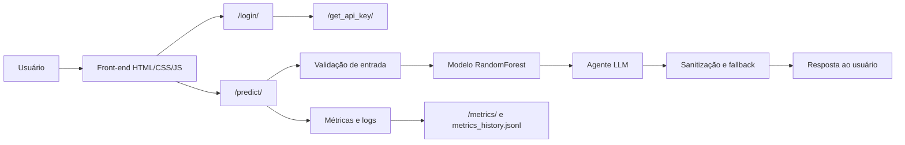

# Churn Prediction Agent

Projeto final individual de previsão de churn com explicação gerada por LLM, API em FastAPI e front-end web simples.

## Antes de tudo

- Relatório final: [docs/relatorio-final.md](docs/relatorio-final.md)
- Avaliação do sistema em produção: [docs/live_system_evaluation.md](docs/live_system_evaluation.md)
- Aplicação publicada: https://my-churn-app.fly.dev/

Se quiser entender a solução em profundidade, comece pelo relatório final. Este README serve como resumo rápido, guia de uso e mapa do ambiente.

## Resumo do projeto

O app recebe dados de um cliente de telecom, estima o risco de churn com um modelo tabular e devolve:

- probabilidade de churn;
- classificação em alto ou baixo risco;
- explicação em português;
- ação sugerida para retenção.

O sistema foi feito para ser simples de operar, fácil de revisar e publicável em produção com pouco atrito.

## Como usar

### Rodar localmente

Configure as variaveis de ambiente, [exemplo de .env](./backend/.env.example) definido na raiz do backend
```bash
python -m venv .venv
source .venv/bin/activate
pip install -r backend/requirements.txt

cd backend
uvicorn app:app --reload
```

Depois abra:

- Swagger: http://localhost:8000/docs
- Interface web: http://localhost:8000/

### Rodar com Docker

```bash
docker compose up --build
```

### Fluxo de uso no app

1. Faça login na interface.
2. Preencha os dados do cliente.
3. Clique em analisar.
4. Leia o risco, a explicação e a ação sugerida.

## Arquitetura



### Peças principais

- [backend/app.py](backend/app.py): API FastAPI, rotas, autenticação e métricas.
- [backend/services/predictor.py](backend/services/predictor.py): carregamento e inferência do modelo.
- [backend/services/ai_agent.py](backend/services/ai_agent.py): explicação gerada pelo LLM com fallback.
- [backend/services/validators.py](backend/services/validators.py): guardrails de entrada.
- [backend/services/metrics.py](backend/services/metrics.py): contadores, latência e custo estimado.
- [backend/services/persistence.py](backend/services/persistence.py): persistência periódica das métricas.
- [backend/templates/index.html](backend/templates/index.html) e [backend/static/script.js](backend/static/script.js): front-end simples.

## Modelo e treino

O modelo foi treinado em [backend/training/train.py](backend/training/train.py) com pipeline de scikit-learn:

- leitura do dataset Telco Customer Churn;
- remoção de `customerID`;
- conversão de `TotalCharges` para numérico;
- separação entre colunas numéricas e categóricas;
- imputação de valores ausentes;
- one-hot encoding;
- `RandomForestClassifier` com `n_estimators=200`, `random_state=42` e `class_weight="balanced"`.

### Divisão de dados

- `train_test_split`
- `test_size=0.2`
- `random_state=42`
- `stratify=y`

### Resultado da avaliação offline

Os resultados salvos em [backend/models/metrics.json](backend/models/metrics.json) mostram:

- ROC-AUC: 0.8194;
- PR-AUC: 0.6082;
- best threshold: 0.3;
- F1 da classe `Churn`: 0.6135.

## Avaliação

Para avaliar o sistema como produto, foi criado o script [scripts/live_evaluation.py](scripts/live_evaluation.py). Ele:

- autentica no app publicado;
- obtém a API key;
- envia casos válidos e inválidos;
- mede latência ponta a ponta;
- lê `/metrics` antes e depois;
- gera relatório em Markdown e JSON.

Resultados da execução em produção:

- taxa de sucesso nos casos válidos: 100%;
- taxa de rejeição nos casos inválidos: 100%;
- latência média de `/predict`: 5.273s;
- latência mediana de `/predict`: 1.182s;
- p95: 12.251s;
- taxa de fallback do agente: 0%.

Os detalhes estão em [docs/live_system_evaluation.md](docs/live_system_evaluation.md) e [docs/live_system_evaluation.json](docs/live_system_evaluation.json).

## Deploy

O sistema foi empacotado com Docker e publicado em Fly.io.

- [Dockerfile](Dockerfile): instala dependências e sobe o Uvicorn.
- [docker-compose.yml](docker-compose.yml): facilita execução local com container.
- [fly.toml](fly.toml): configura serviço, volume e autoscaling.
- [Makefile](Makefile): reúne comandos de setup, teste, avaliação e deploy.

### Comandos úteis

```bash
make setup
make test
make evaluate
make docker-up
make fly-deploy APP=my-churn-app
```

## Dados

O dataset usado é o Telco Customer Churn, disponível no Kaggle e baseado nos exemplos da IBM.

- arquivo local: [backend/data/Telco-Customer-Churn.csv](backend/data/Telco-Customer-Churn.csv)
- referência: Kaggle - Telco Customer Churn (BlastChar)
- contexto: IBM Sample Data Sets

## Exemplos de entrada

### Exemplo de alto risco

```json
{
  "gender": "Female",
  "SeniorCitizen": 1,
  "Partner": "No",
  "Dependents": "No",
  "tenure": 2,
  "PhoneService": "Yes",
  "MultipleLines": "Yes",
  "InternetService": "Fiber optic",
  "OnlineSecurity": "No",
  "OnlineBackup": "No",
  "DeviceProtection": "No",
  "TechSupport": "No",
  "StreamingTV": "Yes",
  "StreamingMovies": "Yes",
  "Contract": "Month-to-month",
  "PaperlessBilling": "Yes",
  "PaymentMethod": "Electronic check",
  "MonthlyCharges": 105.80,
  "TotalCharges": 211.60
}
```

### Exemplo de baixo risco

```json
{
  "gender": "Male",
  "SeniorCitizen": 0,
  "Partner": "Yes",
  "Dependents": "Yes",
  "tenure": 72,
  "PhoneService": "Yes",
  "MultipleLines": "Yes",
  "InternetService": "DSL",
  "OnlineSecurity": "Yes",
  "OnlineBackup": "Yes",
  "DeviceProtection": "Yes",
  "TechSupport": "Yes",
  "StreamingTV": "No",
  "StreamingMovies": "No",
  "Contract": "Two year",
  "PaperlessBilling": "No",
  "PaymentMethod": "Bank transfer (automatic)",
  "MonthlyCharges": 49.90,
  "TotalCharges": 3592.80
}
```

## Melhorias futuras

- adicionar CI/CD automatizado;
- melhorar observabilidade com dashboard;
- endurecer a autenticação e evitar expor a API key ao navegador;
- criar interface mais rica para histórico e métricas;
- fazer avaliação de UX com usuários reais;
- calibrar melhor o threshold do classificador;
- documentar a licença do dataset em seção própria.